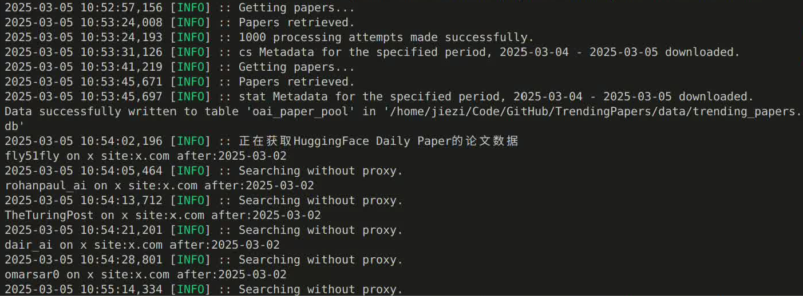
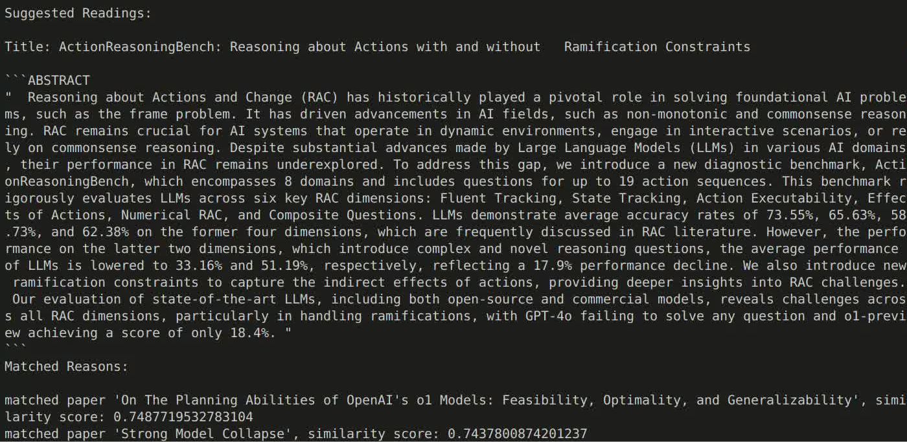

# TrendingPapers
Extracting daily trending papers cater to your interests.

## Why Tending Papers
One may easily get lost in tons of recommendations and daily feeds on latest researches and papers.
This project tries to build a pipeline for geting the most relevant and most important research work automatically especially for you.  
More specifically, it tries to:
1. Get papers from varies sources, including Arxiv preprints, Huggingface daily papers, Twitter posts, Githubs repos, etc.
2. Match papers to one's interest. Given a few keywords or one's reading list from library, daily paper would be further filtered based on semantic similarity.
> for now it only supports Zotero to match paper in your library.
3. Build with data and knowledge management idea (WIP). For example, it tries to interact with Zotero for paper management. It also leverage Sqlite for better data management. 
> paper graph with neo4j is WIP. 

## Data Sources & Matching Logic
Paper are extracted from collective sources including:
- [Arxiv preprint paper metadata](https://arxiv.org/): cover all the past n-day Axiv preprint paper metadata of the field / domain you interested in;
- [Huggingface Daily Paper](https://huggingface.co/papers): daily papers recommended by AK and the research community in Huggingface.co;
- [X Accouts](https://x.com/home): retrieve paper shared and discussed from the twitter accounts you followed;
- [Github Repo](https://github.com/): get the paper information from github repo you specified;

With paper metadata, it then tries to filter and select paper based on your preference. You shall:
- provide Zotero information;
- give a few keywords, phrases or sentences showing your research interest, or topics you want to read;
It would then study the semantic similarity and recommend papers to you.

## Quick Start
**Set up config.py**
Some of the parameters are:
- TIME: By default, all Arxiv paper metadata since yesterday would be collected, while for X accouts, posts of the past three days would be reviewed for paper information.
- ARXIV: adjust domain and category to the ones you interested in.
- TWITTER: specify the accounts you followed, which would lead you to paper information.
- DATABASE: all paper data would be stored in your folder for future usage.
- LLM and EMBED: for now, only Gemini APIs are supported (since they are free of charge!!!). Requires code change if you want to shift to your LLMs.
- API: Zotero is applied to match to papers you read. Firecrwal is used to get Huggingface Daily Papers, since user with proxy IPs would be restricted from geting Huggingface data.

**Run main.py**
Once you get config file ready, you shall start to run main.py. It takes approximately 5 minutes.
Neglect all warnings or log erros (they mainly come from rate limits restrictions), unless your code aborted.
Raise the issue you met.

## FAQs